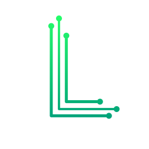

# LIoT (WIP)

LIoT is a easy to use/learn programming language for developing applications for IoT projects...

LIoT was created to help schools doing Arduino projects, without teaching their students the hard and ugly language C++

To actual use the language download the IDE from https://www.github.com/LuanAdemi/LIoT-Studio/
## Example

```javascript
SETUP:
var $myVar = 1
printtolcd("Ready");
ENDSETUP

LOOP:
printtolcd("Loading.");
pinon($myVar);
sleep(1);
pinoff($myVar);
var $myVar = 2
printtolcd("Loading..");
pinon($myVar)
sleep(1);
pinoff($myVar)
var $myVar = 2
printtolcd("Loading...");
pinon($myVar)
sleep(1);
pinoff($myVar)
ENDLOOP
```
